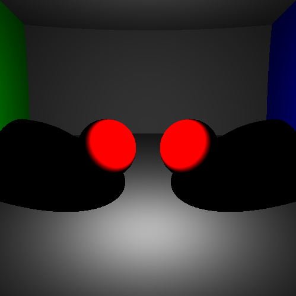
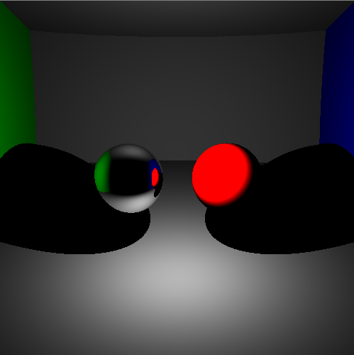
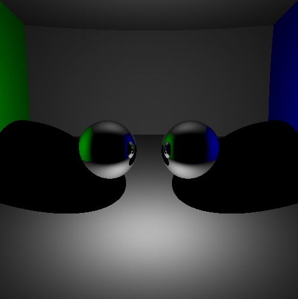

# RayTracer_Gamagora

Implementation of a Ray Tracer integrating direct lighthing, simple shadows and mirror reflexion. This project was made with Visual Studio 2022 and C++
And it is based on the image synthesis course of Guillaume Bouchard at Gamagora (Universite Lumiere Lyon2).

## Library
- [OpenCV](https://opencv.org/)
- [CPPUnitTest](https://learn.microsoft.com/en-us/visualstudio/test/microsoft-visualstudio-testtools-cppunittestframework-api-reference)

## Results

